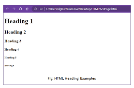
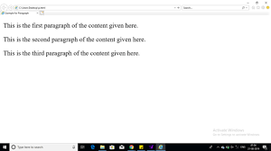

# Note-2 : Understanding Architecture
- core java → CLI app and desktop app
- advanced java and springboot focuses on Web development
- Famous Architecture for WebD : **Client-Server Architecture**
- Client (sends request) -->> Server
---
# Server
> **Server** : Any system which works 24\*7 & provides some response when a request arrives.
- Server sends response in the format of ***HTML, CSS and JavaScript***
- **HTML : HyperText Markup Language**
- **CSS : Cascading Style Sheets**

---
# HTML
- `<tag>` → called a **tag**
- Tag types:
  1. Opening tag → `<html>`
  2. Closing tag → `</html>`
  3. Self-closing tag → `<meta />`, `<br />`, etc.
---
## HTML Code — Line by Line 
```html
<!DOCTYPE html>
<html lang="en">
<head>
    <meta charset="UTF-8">
    <meta name="viewport" content="width=device-width, initial-scale=1.0">
    <title>Document</title>
</head>
<body>
</body>
</html>
```
| Line | Code | Definition |
|------|------|------------|
| 1 | `<!DOCTYPE html>` | Declares that this is an **HTML5** document (not HTML4 or older). |
| 2 | `<html lang="en">` | Root/parent tag of the entire page. `lang="en"` sets language to English. |
| 3 | `<head>` | Opening tag of head section : content here is **NOT visible** in the browser. |
| 4 | `<meta charset="UTF-8">` | Self-closing tag. Sets character encoding to UTF-8 (supports all symbols & languages). |
| 5 | `<meta name="viewport" content="width=device-width, initial-scale=1.0">` | Self-closing tag. Makes the page **responsive**: adjusts layout to the device screen width. |
| 6 | `<title>Document</title>` | Sets the **tab title** shown in the browser tab bar. |
| 7 | `</head>` | Closing tag of the head section. |
| 8 | `<body>` | Opening tag of body section : **all visible content** goes here **(text, images, buttons, etc.).** |
| 9 | `</body>` | Closing tag of the body section. |
| 10 | `</html>` | Closing tag of the root html element : marks the **end of the webpage**. |
---
## Quick Summary
- `<!DOCTYPE html>` → tells browser: "use HTML5"
- `<html>` → wraps everything
- `<head>` → metadata (invisible to user)
- `<meta charset>` → character set
- `<meta viewport>` → mobile responsiveness
- `<title>` → browser tab name
- `<body>` → visible page content
---
## Heading Tags in HTML
``` 
<h1>Heading 1</h1>
<h2>Heading 2</h2>
<h3>Heading 3</h3>
<h4>Heading 4</h4>
<h5>Heading 5</h5>
<h6>Heading 6</h6>
```

## Paragraph Tags in HTML
```
<p>This is the first paragraph of the content given here</p>
<p>This is the second paragraph of the content given here</p>
<p>This is the third paragraph of the content given here</p>
```

---
## Favicon Generator


***By Anisha Sarangi***